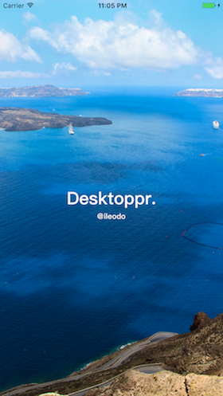
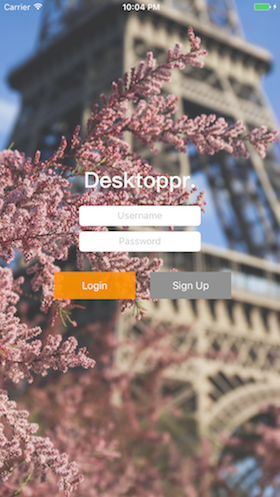
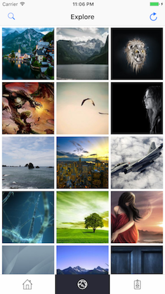

# Desktoppr-iOS

## Screen Shots

## Introduction
[Desktoppr.co](http://desktoppr.co) is an impressive wallpaper share website developed by [@keithpitt](https://twitter.com/keithpitt) and [@mariovisic](https://twitter.com/mariovisic).

It contains massive high quality desktop wallpapers, which can be synchronized into Dropbox through Dropbox API. You can easily setup rotating wallpapers in Dropbox folders under macOS/Windows/Linux([Instructions](https://www.desktoppr.co/faq)). 

This project is an iOS app for it based on its official [API](https://www.desktoppr.co/api), providing most of the important features.

## Features

- Login / Logout
- View suggessted wallpapers
- Explore random wallpapers
- Like/Sync/Flag wallpapers
- Follow/Unfollow Users

## Todo
- Signup View

## Contribution
This project is open for contributing. Please fork and create PR to contribute.

## Third Party Library
- [SKPhotoBrowser](https://github.com/suzuki-0000/SKPhotoBrowser)
- [KeychainAccess](https://github.com/kishikawakatsumi/KeychainAccess)
- [Alamofire](https://github.com/Alamofire/Alamofire)
- [AlamofireObjectMapper](https://github.com/tristanhimmelman/AlamofireObjectMapper)
- [SwiftyJSON](https://github.com/SwiftyJSON/SwiftyJSON)

## Acknowledgement
- [desktoppr.co](http://desktoppr.co)
- [Desktoppr API](https://www.desktoppr.co/api)
- Wallpapers are owned by their respective creators.
